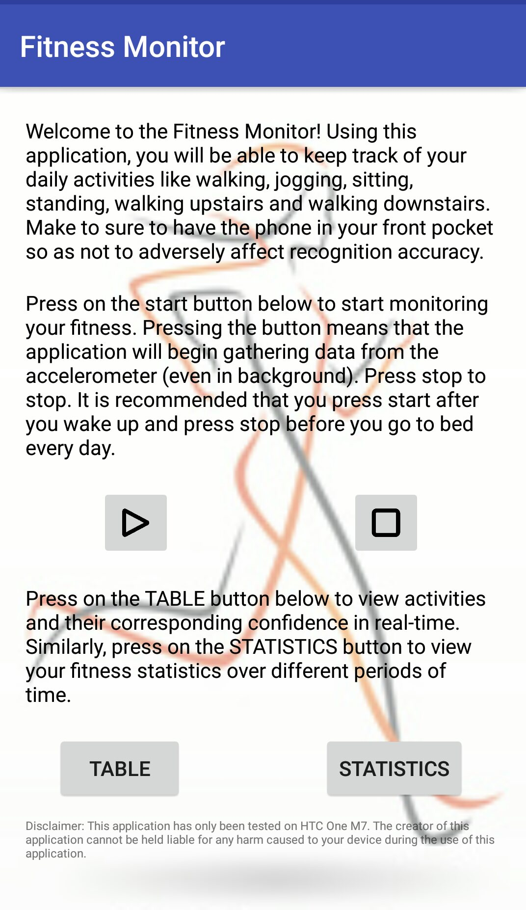
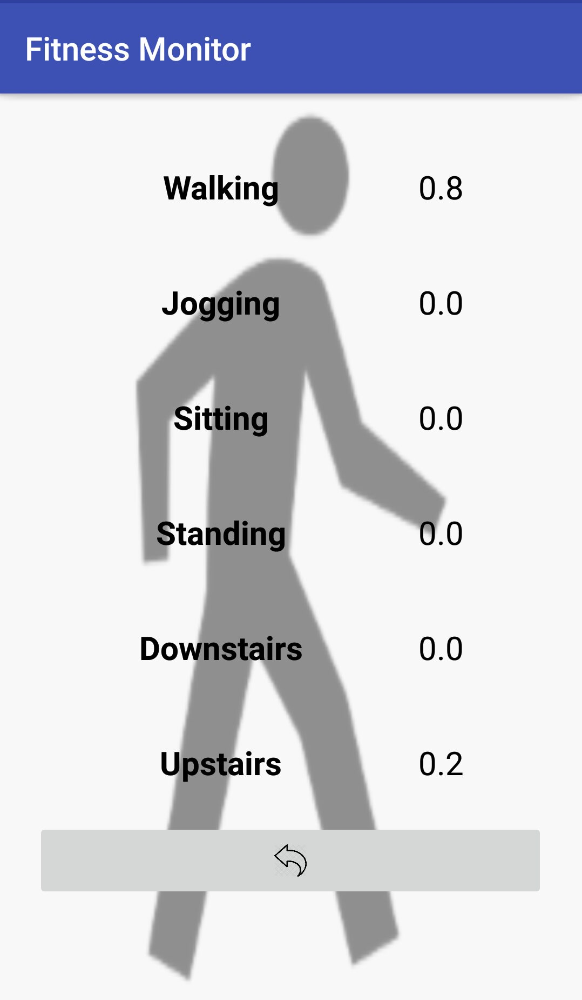
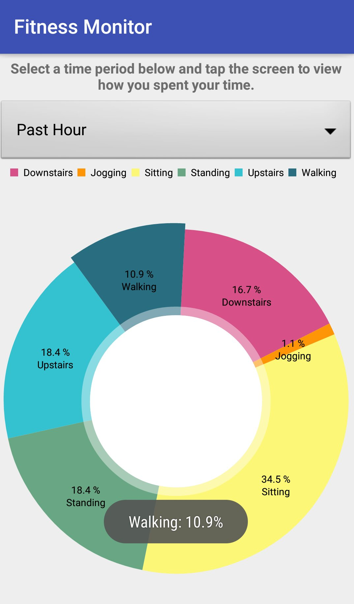

# FitnesssMonitor
Fitness Monitor is an Android application that users can use to track their daily activities like walking, jogging, sitting, standing, walking upstairs and walking downstairs. The application uses a Convolutional Neural Network (CNN) to predict user activity automatically and stores the information in a database stored on the phone. The users can then choose to visualize the statistics.

# Java File Structure
1. MainActivity
    - Registers/unregisters event listener
    - Records readings from the accelerometers
    - Calls RecognitionActivity for prediction and chooses activity with highest confidence score
    - Inserts predicted activity to a SQLite database in the background
    
2. RecognitionActivity
    - Initializes trained CNN classifier
    - Feeds normalized input into the classifier and sends output back to MainActivity
    
3. DisplayStatsActivity
    - Queries the SQLite database to display pie chart on the screen
    
4. Activity
    - Contains database schema in the form of objects (uses Room Persistence Library)
    
5. ActivityDao
    - Provides interface to modify and query the database (through Data Access Objects)
    
6. AppDatabase
    - Initializes an SQLite database for the application
    
7. Constants
    - Holds constant values used in all class files
    
# Screenshots

  
   
  

